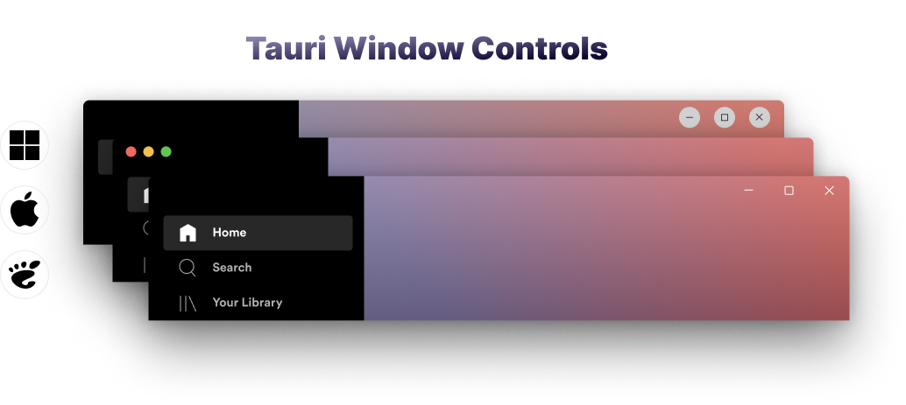
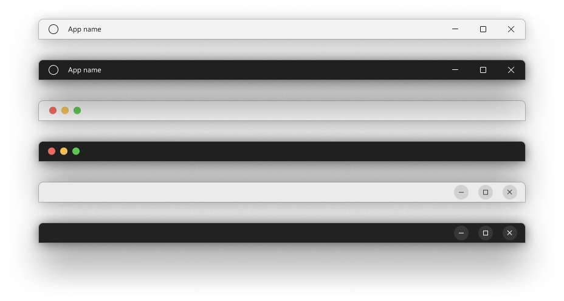

<picture>
  <source media="(prefers-color-scheme: dark)" srcset=".github/statics/TauriCoverDark.png">
  
</picture>

<!-- 

 -->

**Tauri Controls** is a library that provides native-looking **window controls** for Tauri 2 applications. You can enhance the user experience of your Tauri 2 applications with window controls that mimic the identical native controls on the current system.

The following designs are taken as reference:

- [Windows UI 3](https://www.figma.com/community/file/1159947337437047524) @microsoft
- [Apple Design Resources - macOS](https://www.figma.com/community/file/1251588934545918753) @apple

## How to use

### Install Dependencies

```bash
pnpm add tauri-controls

#install peer dependencies
pnpm add @tauri-apps/plugin-os @tauri-apps/plugin-window
pnpm add -D clsx tailwind-merge
```

Then, make sure to include the following tauri plugins in your `src-tauri` directory:

```bash
cargo add tauri-plugin-window tauri-plugin-os
```

Don't forget to register plugins in your main function.

```rust
fn main() {
    tauri::Builder::default()
        .plugin(tauri_plugin_os::init())
        .plugin(tauri_plugin_window::init())
        .run(tauri::generate_context!())
        .expect("error while running tauri application");
}
```

### Add to Your Code

And simply add the `WindowControls` component to your code:

```tsx
import { WindowControls } from "tauri-controls"

function MyTitlebar() {
  return <WindowControls />
}

// if no platform is specified, the current system will be detected
// and the matching element will be returned.
```

> _tauri-controls_ uses Tauri's [`window` API](https://next--tauri.netlify.app/next/api/js/window) to handle window events and just provides a **React element**, _it does not rely on the system's native APIs_.

[](https://www.figma.com/file/ms2vbZx5lEGxHqHR8fAfQm/Desktop-Native-Window-Controls?type=design&node-id=4%3A6020&mode=design&t=PIbVTsr8zWmIFsNr-1)

### Options

```ts
// specify which platform's window controls to display
platform?: "windows" | "macos" | "gnome"
```

You can also pass additional `props` to elements like `data-tauri-drag-region` for further enhancements.

### Examples:

```tsx
<WindowControls platform="macos" className="my-4" />
```


```tsx
<WindowControls platform="windows" className="w-full justify-end" data-tauri-drag-region />
```


# To-Do

If the library gets some interest, I can gradually add the following features:

- [ ] Add declaration file.
- [ ] Detect disabled window controls (is_maximizable, ...) and disable the buttons accordingly.
- [ ] Disable icons option for macOs.
- [ ] Svelte/SvelteKit implementation.

## Figma

Check out the design implementation on Figma for a visual reference. [Desktop Native Window Controls - Figma](https://www.figma.com/file/ms2vbZx5lEGxHqHR8fAfQm/Desktop-Native-Window-Controls?type=design&node-id=4%3A6020&mode=design&t=PIbVTsr8zWmIFsNr-1).

These sources were utilized:

- [Windows UI 3](https://www.figma.com/community/file/1159947337437047524) @microsoft
- [Apple Design Resources - macOS](https://www.figma.com/community/file/1251588934545918753) @apple
- [macOS Monterey UI Kit for Figma](https://www.figma.com/community/file/1034539431656086181/macOS-Monterey-UI-Kit-for-Figma) @joey
- [Spotify Desktop App Clone](https://www.figma.com/community/file/1028665514709480268/Spotify-Desktop-App-Clone) @uidesignguide

## License

MIT
